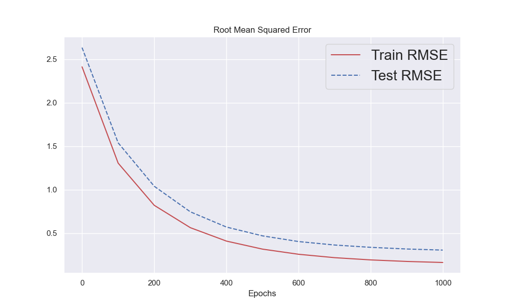

# DubsTech-Datathon-2023

#### The Task

All Foods, is a grocery store in Melbourne, Australia that sells a variety of groceries ranging from fresh produce to grains to snacks to dairy and eggs and more. And to cater to the diverse population of Melbourne they have even introduced foods from asian countries such as Sri Lanka! 

In the year 2017, the store operated for all hours of the day. However for the year 2018, the store changed strategy and was open only from 7am to 7pm daily. This dropped their revenues by more than $50,000 and profits by more than $40,000!

While this strategy has allowed them to save on operations cost, they are keen for it not impact their revenue any further for the year 2019. Therefore they have hired you and your team as an analyst to gain insights and ideas that can help them recover the lost revenues due to change in time. 

## Datathon Submission Presentation

[Presentation Link](https://docs.google.com/presentation/d/1nb3SO0GwrA2altb8U1LN08yKqxB0s_uy4rKRcNzoAgo/edit?usp=sharing)

[Tableau Dashboard Updated Link](https://public.tableau.com/views/OrcaCorps_RetailAnalysis_16774575377730/ProductAnalysisYoY?:language=en-US&publish=yes&:display_count=n&:origin=viz_share_link)

## Methodology

Being a retail storefront, we believe it was important to include an interactive dashboard, wherein the store team can view how their various segments are doing over time. Specially observing the change in timings, it is crucial to know how individual products have done from 2017 to 2018. 

Retail stores mainly include commodity products, wherein different stores do not differ a lot in terms of the products or prices they offer. In this case, Marketing the right way becomes crucial. We believe that since the store sells so many home grown items, they should market themselves as "Farm-to-Table" concept store.

>>According to data from the USDA, National Agricultural Statistics Service (NASS), sales of local edible farm products in 2017 totaled $11.8 billion, or 3 percent of all agricultural sales in 2017, up from $8.7 billion in 2015.

Using the results from the **Basket Analysis**, implemented using the Apriori Algorithm, the store can group commonly bought items together and offer discounts on products. A commonly bought second item? Carrots! They are grouped with many other vegetables.

To understand the future needs of the store, we took into consideration how the Buying Price and Quantity influence the future Total Profit of the store using Machine Learning. This can help the store budget their Working Capital in a way that helps them stay steady, while the profits gradually increase.

## Market-Basket Analysis

Using Frequent Itemset Mining, we can analyze which groups of items are frequently bought together. This is implemented using the Apriori Algorithm in Python. Using Minimum Lift as 3 (In this case, lift>1 means the items are more likely to be bought together), we observe the following associations:

  

## Updated ML Model

For the Datathon2023 submission, we had used an XGBoost model with lag features. Due to the time contraints, we had only trained it using 10 Trees (n_estimators) with a Learning Rate of 0.1.
To improve the efficieny, I used a simpler model (no lag features) but with 1000 Trees and a Learning Rate of 0.01 to avoid overfitting. In this case, 1000 n_estimators can be used as the dataset is not very big. 

|      |   Old Model   | Updated Model |
| -----| ------------- | ------------- |
| RMSE |    0.86018    |    0.30484    |

  

## Updated Tableau Dashboard

The Retail Store team can analyse the performance of each Item, to understand how to stock their inventory and price their products. 

  

Analyzing the performance of each Item and Sub-category can help them understand what caused the decrease in profits. 

  

The What-if analysis is useful to project future profits for the team

  

A detailed overview of all methods can be found in the Presentation linked above. 
